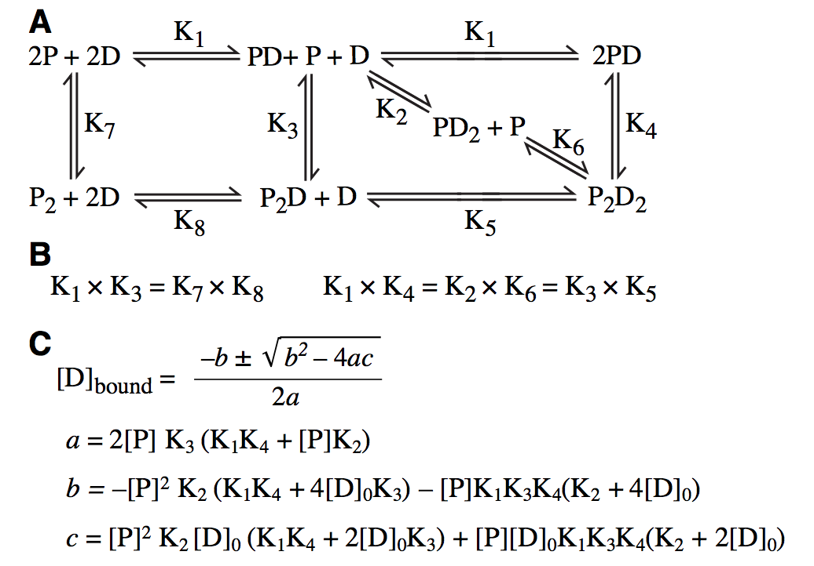

# TLR9_Anisotropy

---

## Overview
These scripts were written by Dr. Stevie Reikine, while working in the lab of [Dr. Yorgo Modis](https://www.med.cam.ac.uk/modis/). 
They generate simulations of Fluorescence Anisotropy data for a binding model. The model is defined explicitly in the scripts. 

### Data

The data that was used to fit K1 and K4 for the paper is provided as a .txt file. 

### Fluorescence Anisotropy

Fluorescence Anisotropy can be a nice technique for determining the binding affinity between a small ligand (e.g. an oligonucleotide) and its larger binding partner (e.g. a protein). 

Some useful links to futher understand the technique: 
[A good overview of the technique](https://www.horiba.com/en_en/technology/measurement-and-control-techniques/spectroscopy/fluorescence-spectroscopy/what-is-fluorescence-anisotropy-or-fluorescence-polarization/)
[A thorough explanation of fitting Kd to FP data is found in CHAPTER 8 of this detailed guide.](https://research.fhcrc.org/content/dam/stripe/hahn/methods/biochem/beacon_fluorescence_guide.pdf)
[A nice example of how to apply this technique](https://www.bmglabtech.com/high-throughput-protein-dna-measurement-using-fluorescence-anisotropy/)

### Equilibrium Binding Model

